For Windows :

## [1. Installing Miniconda3](https://docs.conda.io/en/latest/miniconda.html)


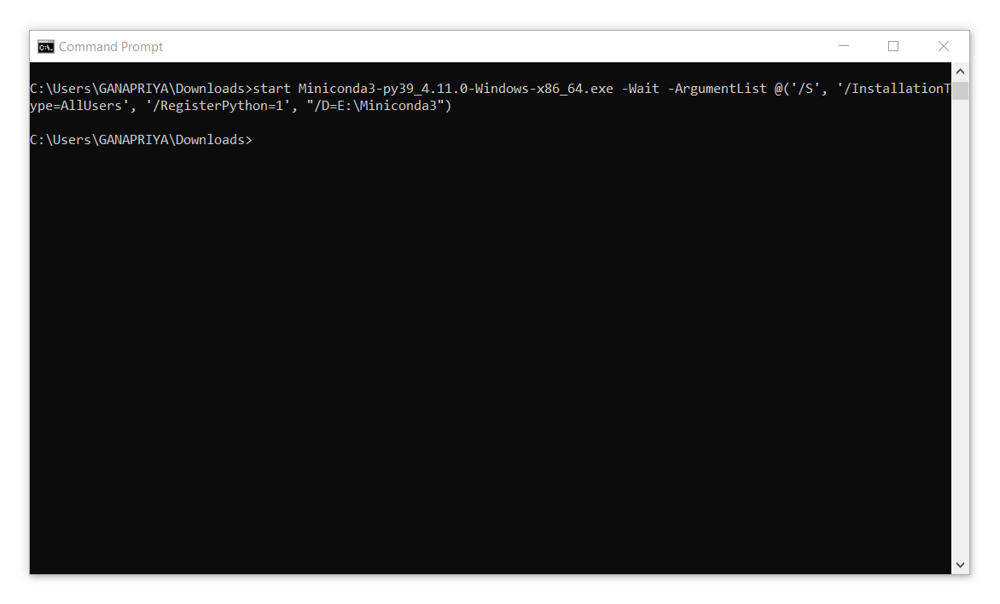
<br>

```
start Miniconda3-py39_4.11.0-Windows-x86_64.exe -Wait -ArgumentList @('/S', '/InstallationType=AllUsers', '/RegisterPython=1', "/D=E:\Miniconda3")
```
<br>

## 2. Managing Environment
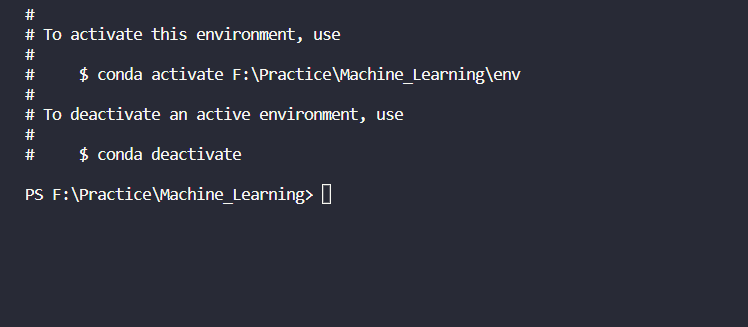

To create an environment
```
conda create --prefix ./env pandas numpy other_libraries
```
To activate this envrionment
```
conda activate ./env
```
If any error in activating env , use conda init bashname
```
conda init bashname
```

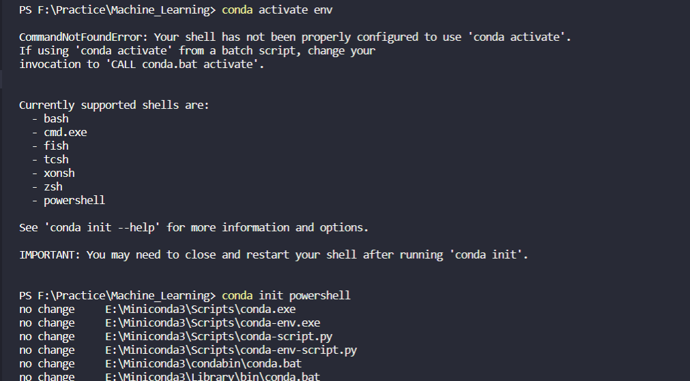

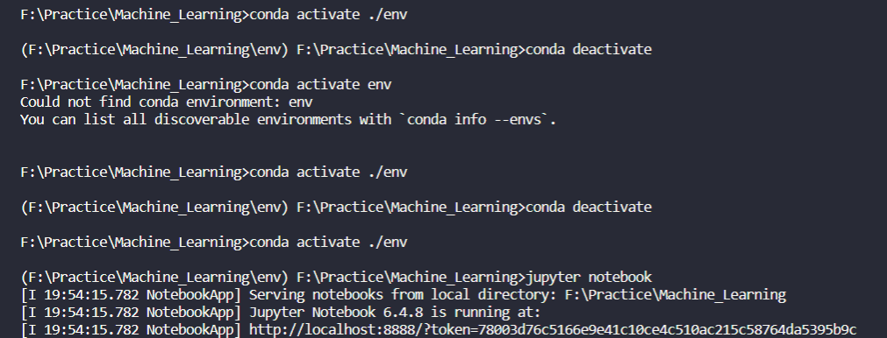
<br>

To deactivate 
```
conda deactivate
```

To run jupyter notebook using conda at particular drive
```
conda run jupyter notebook --notebook-dir=F:\
```

---

<br>
For linux :
<br>

## [1. Installing Miniconda3](https://docs.conda.io/en/latest/miniconda.html)


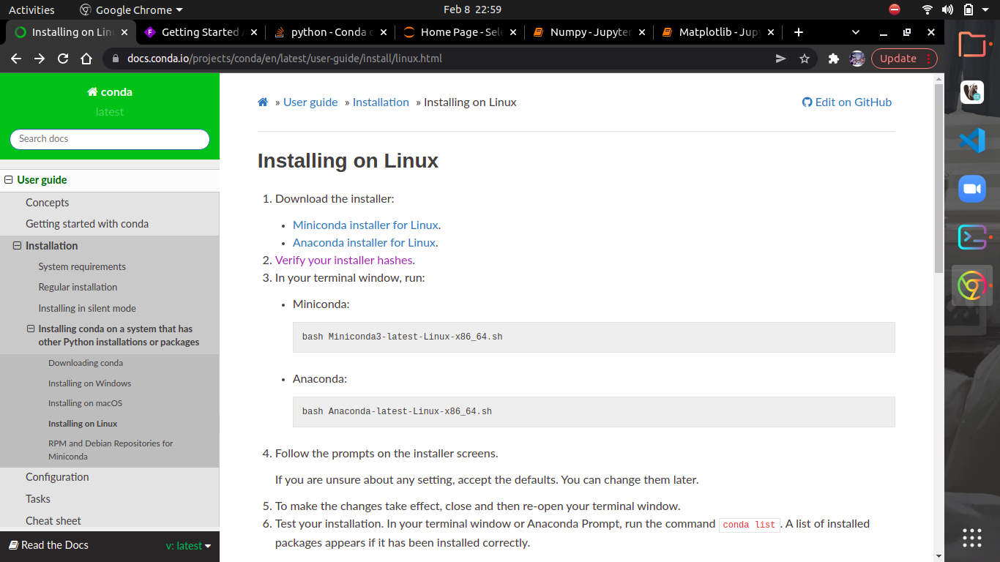

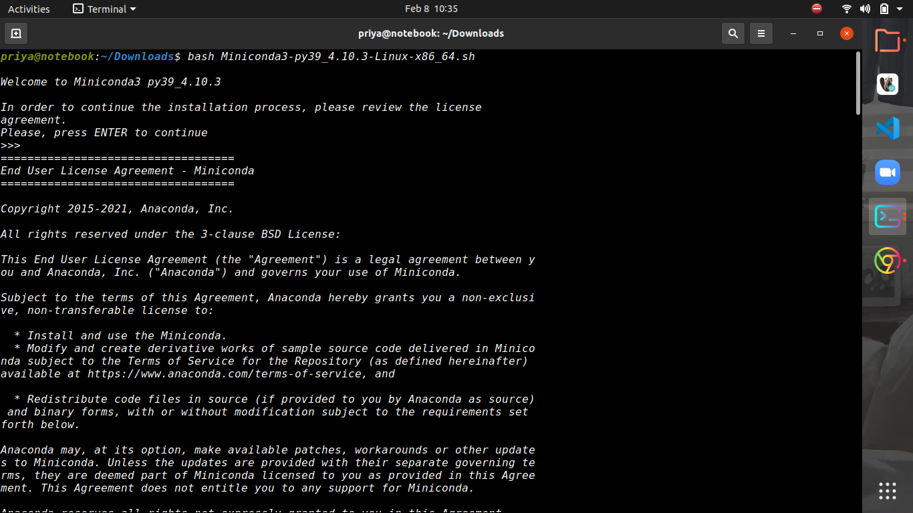
<br>

```
bash Miniconda3-latest-Linux-x86_64.sh 
```
<br>

## 2. Managing conda
```
conda --version
```
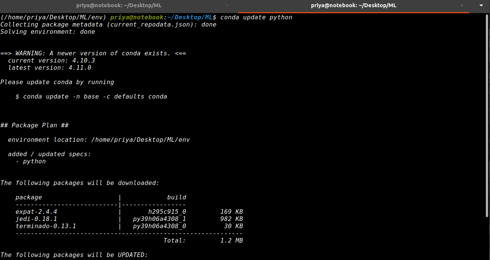 \
To update packages
```
conda update package
```

To update conda
```
conda update conda
```

<br>

## 3. Managing environment

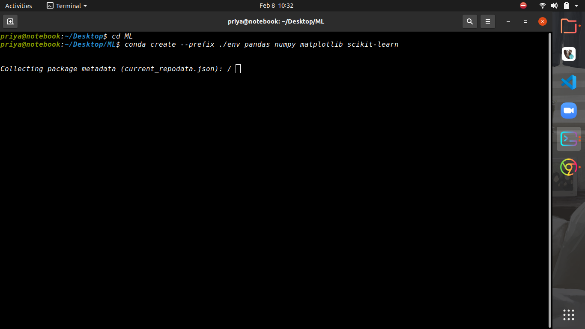

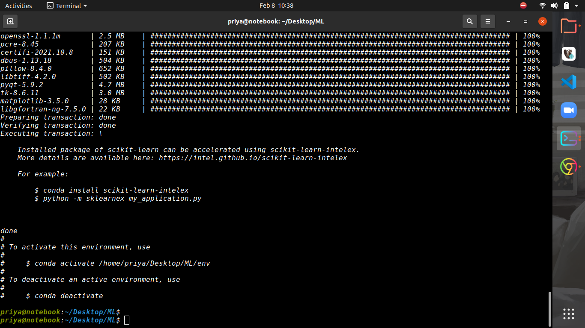
<br>

```
conda create --prefix ./env pandas numpy other_libraries python=3.x
```

To verify environment added 
```
conda info --envs
```

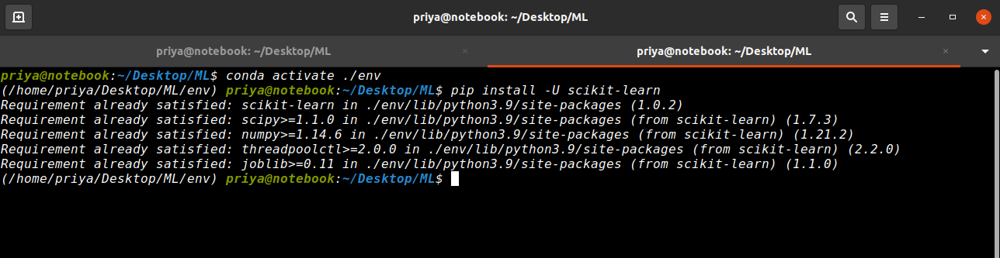


<br>

To active environment
```
conda activate
```

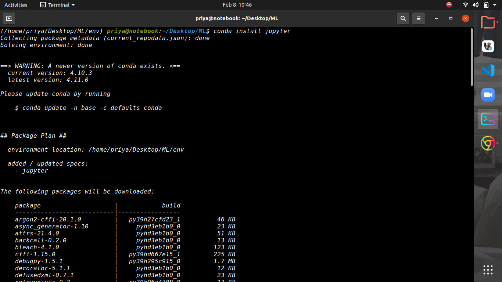

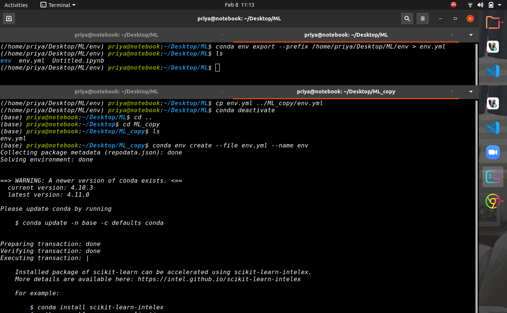

<br>

To create yml file from env
```
conda env export --prefix /path/../env > env.yml 

or 

conda env export > env.yml
```

To create environment from env file
```
conda env create -f env.yml 

or

conda env create --file env.yml --name env
```
To specify location for an environement
```
conda env create --prefix ./env -f ../env.yml
```


[Documentation-1](https://docs.conda.io/projects/conda/en/latest/user-guide/getting-started.html)

[Documentation-2](https://docs.conda.io/projects/conda/en/latest/user-guide/tasks/manage-environments.html)

<br>

## 4. Managing packages


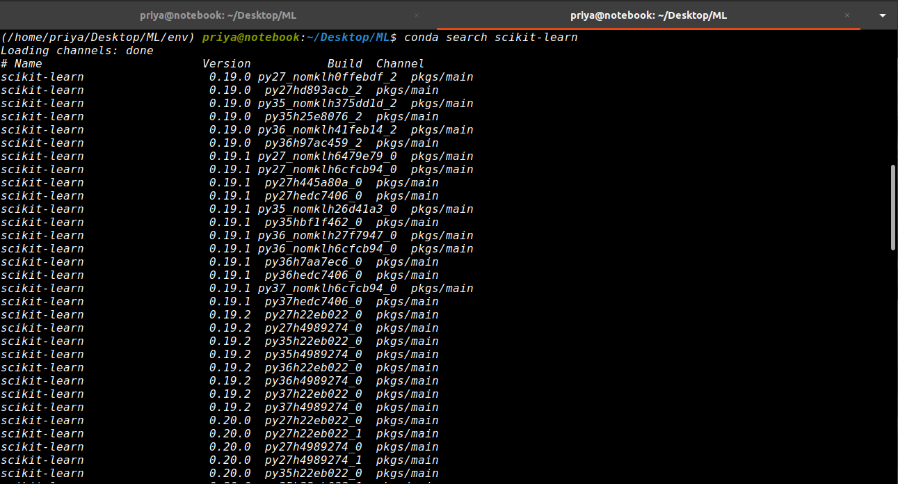

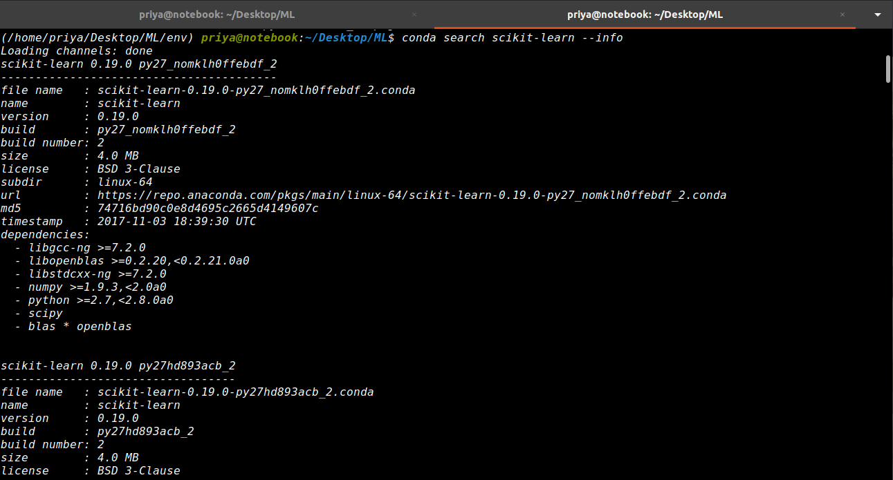
<br>

To search is any package installed or not

```
conda search package
```
To install package
```
conda install package
```

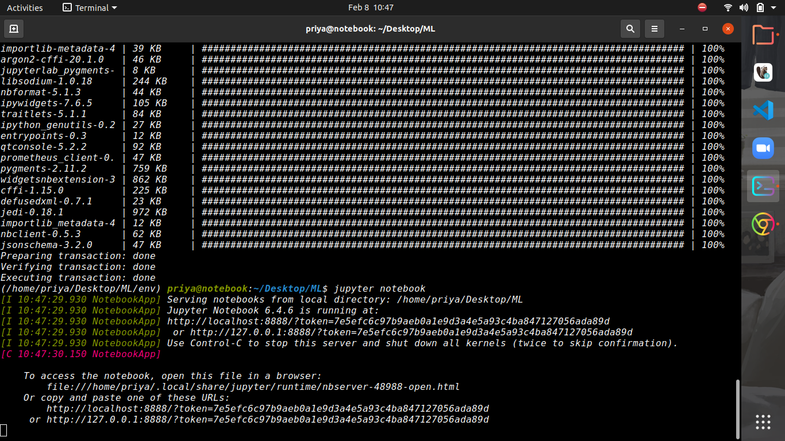

<br>
To run jupter notebook

```
jupyter notebook
```


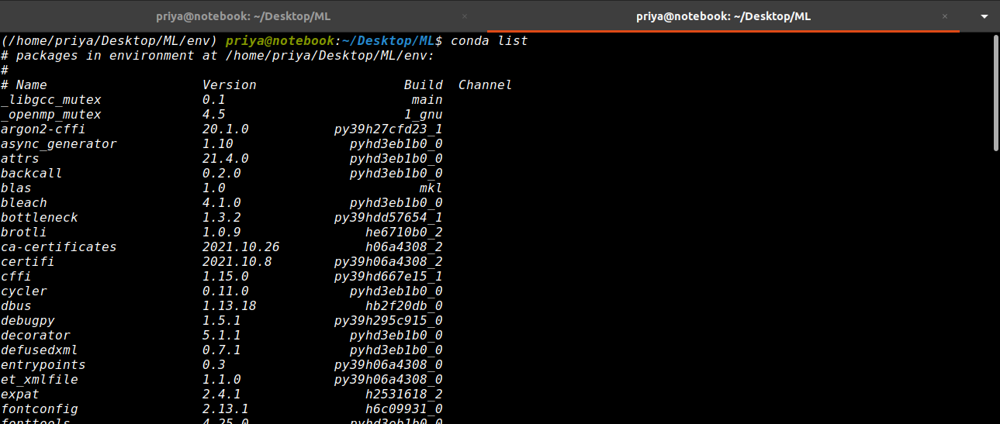

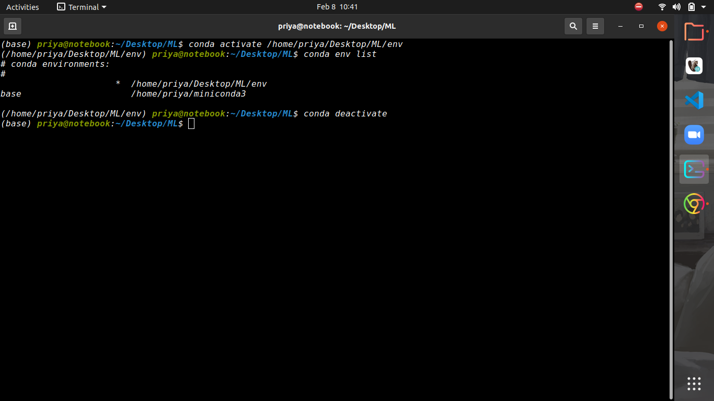
<br>

To list installed program in the environment
```
conda list
```
To deactivate conda 
```
conda deactivate
```
To uninstall packages
```
conda uninstall package
```
<br>

## Others


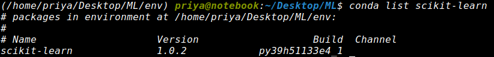
<br>